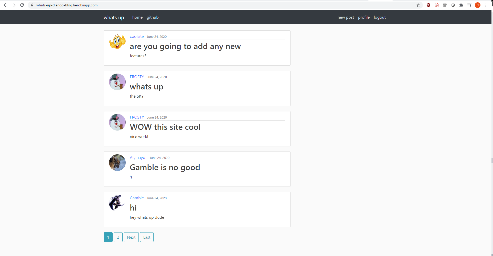

# whats-up-application
---

answer the question on my public blog - whats up?

This is a social media type application developed using the popular web framework Django. Users can create posts about anything they would like, but the predominant theme is to answer the question - what's up? The features of this site include a registration portal, login/logout system, a profile system, the ability to update posts, and pagination. The website is hosted using Heroku and uses PostgreSQL for database purposes (and AWS S3 for file storage).

you can check it out at: https://whats-up-django-blog.herokuapp.com/
